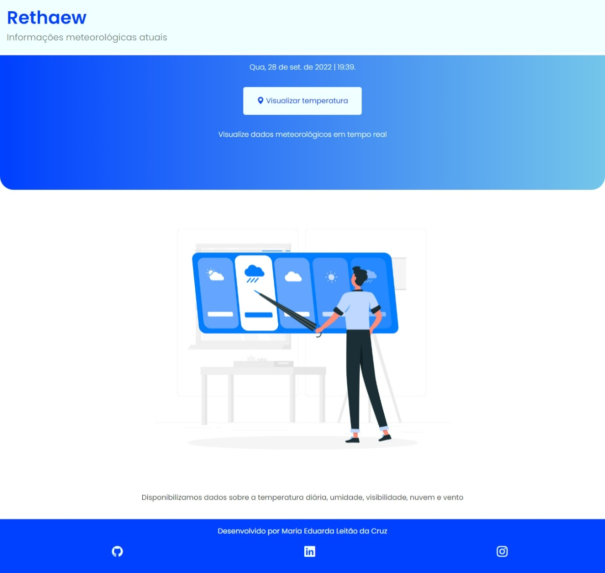
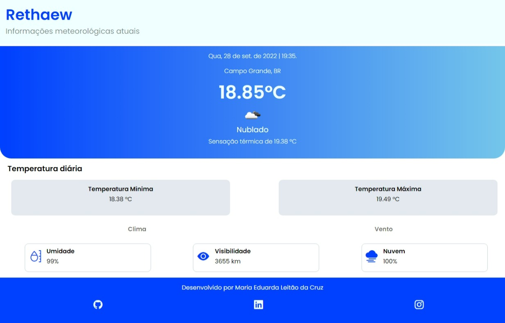

# 🌥️ Rethaew App

Uma aplicação web de clima

🖇️ [Acesse o site](https://mariamourie.github.io/rethaew-app/)

## Tabela de conteúdos

   - [Sobre](#Sobre)
      - [Funcionalidades](#Funcionalidades)
      - [Screenshot](#Screenshot)
   - [Meu processo](#Processo)
      - [Tecnologias](#Tecnologias)
      - [Ferramentas utilizadas](#FerramentasUtilizadas)
   - [APIs](#Apis)
   - [Aprendizado](#Aprendizado)
   - [Autor](#Autor)
## Sobre

O Rethaew App é uma aplicação web que fornece dados metereológicos em tempo real.

### ⚙️ Funcionalidades

Os usuários devem estar aptos a:

- Visualizar efeito hover em todos os elementos interativos do site
- Visualizar as seguintes informações no evento de clique do botão
   - Data
   - Horário da última atualização da página
   - Bairro, sigla do país (Ex.: Copacabana, BR)
   - Temperatura atual, mínima e máxima diária
   - Sensação térmica
   - Porcentagem de umidade
   - Visibilidade em km
   - Porcentagem de nuvem
   - Vento em m/seg
   - Direção do vento

### 📸 Screenshot

## Meu processo

### 🛠️ Tecnologias

As seguintes ferramentas foram usadas na construção do projeto:

   

### 🛠️ Ferramentas utilizadas

- Bootstrap Icons
- Google Fonts
- Ilustração do Freepik, feito por slidesgo.

### 💻 APIs
 
As APIs utilizadas nesse projeto:

- Geolocation
- [OpenWeather](https://openweathermap.org/)

## 📚 Aprendizado

Nesse projeto eu aprendi a:

- Usar a API fetch do JavaScript
- Usar a função async await
- Manipulação de arquivo JSON
- Alguns seletores e funções da biblioteca JQuery
- Consumir uma API

## 👩🏽‍💻 Autor

  
   <h3>Feito por Maria Eduarda Cruz, Desenvolvedora Front-End</h3>
  

### 📲 Redes Sociais

 

